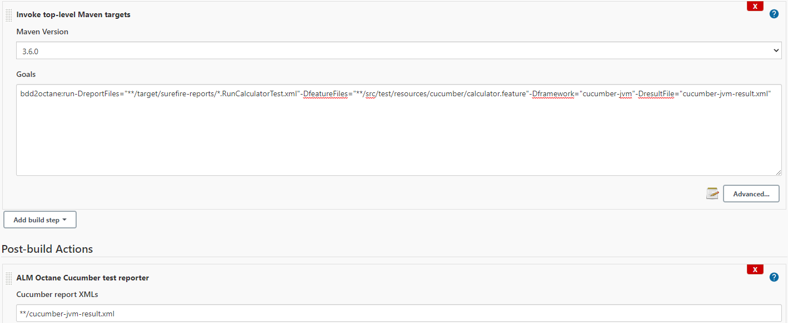

## A tool that enables customer to import BDD test result into Octane

This tool parses the JUnit style XML report generated by various BDD frameworks crosschecking
the relevant .feature files in Gherkin syntax, 
sends the result to Octane via the 
[Micro Focus Application Automation Tools](https://plugins.jenkins.io/hp-application-automation-tools-plugin/)
This tool is configured as a build step before the "ALM Octane Cucumber test reporter". 

The following frameworks are currently supported Out-Of-The-Box. 
- cucumber-js
  > verfied version: 4.2.1, 5.1.0, 6.0.5, 7.3.0
- php-behat
  > verified version: 3.8.1
- python-radish
  > verified version: 0.13.2, 0.13.4 
- python-behave
  > verified version: 1.2.5, 1.2.6
- cucumber-jvm
  > verifed versions: 2.0.0 - 7.0.0  
  > not supported version: 1.2.6
- cucumber-ruby
  > verified versions: 4.0.0, 5.0.0, 6.0.0, 7.0.0

One can add own framework by implementing the interface: [BddFrameworkHandler](./src/main/java/com/microfocus/bdd/api/BddFrameworkHandler.java)

### Two ways to invoke this tool
 1. Run as an executable-jar
    
    Admin of CI downloads the .jar file and deploys it to the CI server nodes,
    then create a job to invoke the following command line: 
     
    >**java -jar <path_to_the_jar> --reportFiles=<path_or_pattern> --featureFiles=<path_or_pattern> --framework=\<framework> --resultFile=\<path_to_result_file>**
    
    or a short version:
    > **java -jar <path_to_the_jar> -rf=<path_or_pattern> -ff=<path_or_pattern> -f=\<framework> -r=\<path_to_result_file>**
    
    the --resultFile is optional, if not provided, the default result file is <*framework*>-result.xml. 
     
    The following picture is a sample configure of Jenkins in Windows environment. As you can see, the second action consumers the result
    file from first action, cucumber-jvm-result.xml
    

 2. Run as a maven plugin

    This tool is published on Maven repository as a plugin. You can invode the plugin by using fully qualified plugin ID
    or a short version. Unlike the previous way, CI admin doesn't need to manually deploy the tool.

    > **mvn bdd2octane:run -DreportFiles=<path_or_pattern> -DfeatureFiles=<path_or_pattern> -Dframework=\<framework> -DresultFile=<path_to_result_file>**

    The following picture is a sample configure of invoking a maven target to run the plugin.
    

### Notes on Cucumber-js

* Cucumber-js using Gherkin library to parse feature file. For cucumber-js version 6.x and below, it uses Gherkin
  library in version 5 or below which does not support key word "Example". If feature file contains "Example" as key
  word, the program will throw error. It is recommended to use "Scenario" instead of "Example" as scenario key word to
  avoid such error.
* "Example" key word was added to Gherkin library in version 6.0.13 on 9/25
  2018 [Gherkin library changelog](https://github.com/cucumber/common/blob/main/gherkin/CHANGELOG.md#6013---2018-09-25).
  Cucumber-js version 7 and above applies the updated gherkin library and won't have such problem.

### Notes on Cucumber-jvm
* if **useFileNameCompatibleName** is enabled, the space character in feature name is replace with underscore(_) in JUnit report ,
  currently the handler doesn't support this configuration.
    
* Since maven sure-fire 2.19.1, the JUnit report doesn't include failing call stack in \<failure> element or \<error> element, 
It is required to enable the "pretty" option of cucumber-jvm, this tool will parse the <system-out> tag instead.
  
* There is a BUG in surefire, if the feature name includes parenthesis, the JUnit report is mangled. [SUREFIRE-1952](https://issues.apache.org/jira/browse/SUREFIRE-1952)

* if **stepNotifications** is enabled, feature name and scenario name will be replaced by scenario name and step name in JUnit report ,
  currently the handler doesn't support this configuration.